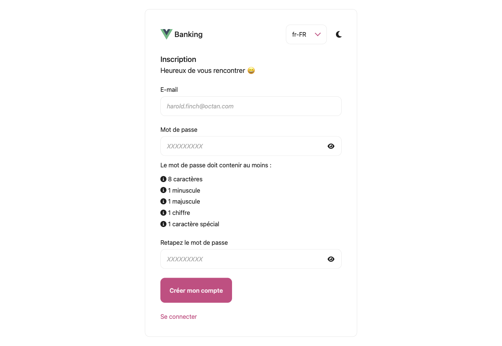

# loginregister
A small working example of a Vue.js website with a login/register page using gRPC.

## How to run it

`npm install`

`go run cmd/main.go -dev -path test`

Do not forget to change the settings in the `test` folder.

## Screenshots

